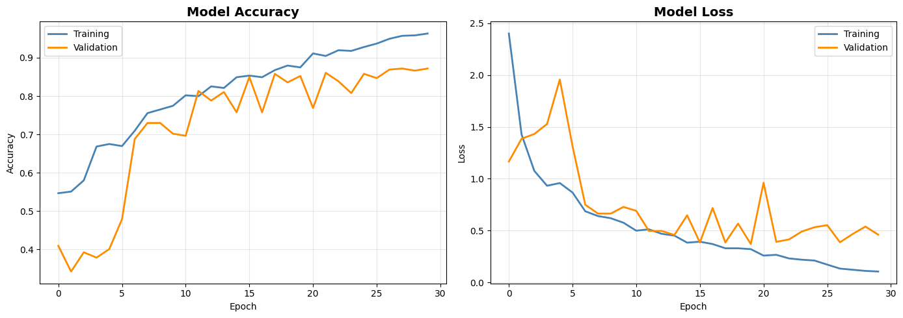
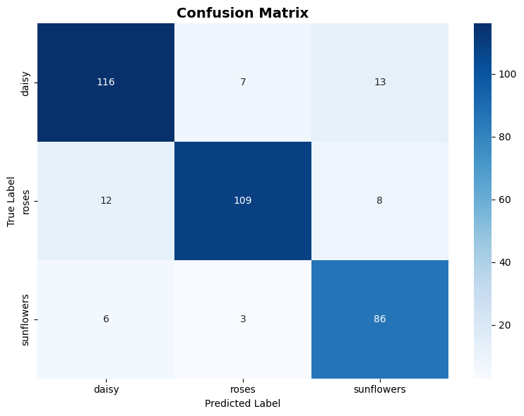

# Laporan CNN Image Classification
**Mata Kuliah:** Machine Learning — Pertemuan 15  
**Tanggal:** 2026-05-28 00:15

---

## 1. Dataset

| Atribut | Nilai |
|---------|-------|
| Nama | TensorFlow Flowers |
| Sumber | https://www.tensorflow.org/datasets/catalog/tf_flowers |
| Kelas | daisy, roses, sunflowers |
| Jumlah kelas | 3 |
| Total gambar (3 kelas) | 2396 |
| Training (70%) | 1677 gambar |
| Validation (15%) | 359 gambar |
| Testing (15%) | 360 gambar |
| Ukuran input | 128 × 128 piksel (RGB) |

---

## 2. Preprocessing

- **Resize**: semua gambar diubah ke **128 × 128 piksel**
- **Normalisasi**: nilai piksel dibagi 255 → rentang `[0.0, 1.0]`
- **Augmentasi** (training only): random flip horizontal & vertikal, brightness, contrast, saturation

---

## 3. Arsitektur CNN (Task 1 & 2)

```
INPUT (128×128×3)
    │
    ├─ BLOCK 1 ─ Conv2D(32, 3×3, ReLU) × 2 → MaxPool(2×2) → BatchNorm → Dropout(0.25)
    ├─ BLOCK 2 ─ Conv2D(64, 3×3, ReLU) × 2 → MaxPool(2×2) → BatchNorm → Dropout(0.25)
    ├─ BLOCK 3 ─ Conv2D(128,3×3, ReLU) × 2 → MaxPool(2×2) → BatchNorm → Dropout(0.40)
    ├─ Flatten
    ├─ Dense(256, ReLU) → Dropout(0.5)
    ├─ Dense(128, ReLU) → Dropout(0.3)
    └─ OUTPUT: Dense(3, Softmax)
```

| Komponen | Layer |
|----------|-------|
| a. Convolution Layer | `Conv2D` |
| b. Activation Function | `ReLU` (hidden), `Softmax` (output) |
| c. Pooling Layer | `MaxPooling2D(2×2)` |
| d. Flatten Layer | `Flatten` |
| e. Dense Layer | `Dense(256)`, `Dense(128)` |
| f. Output Layer | `Dense(3, softmax)` |

Tabel parameter lengkap: lihat `outputs/model_summary.txt`

---

## 4. Training

| Parameter | Nilai |
|-----------|-------|
| Optimizer | Adam (lr = 0.001) |
| Loss | Sparse Categorical Crossentropy |
| Epochs (max) | 30 |
| Epochs berjalan | 30 |
| Early Stopping | patience = 10 (monitor: val_accuracy) |
| ReduceLROnPlateau | patience = 5, factor = 0.5 |



---

## 5. Hasil Evaluasi

| Metrik | Nilai |
|--------|-------|
| Best Val Accuracy | **0.8719** (87.19%) |
| Best Val Loss | 0.3709 |
| **Test Accuracy** | **0.8833** (88.33%) |
| **Test Loss** | **0.4545** |

### Confusion Matrix



### Classification Report

```
              precision    recall  f1-score   support

       daisy       0.87      0.85      0.86       136
       roses       0.92      0.84      0.88       129
  sunflowers       0.80      0.91      0.85        95

    accuracy                           0.86       360
   macro avg       0.86      0.87      0.86       360
weighted avg       0.87      0.86      0.86       360

```

---

## 6. Diskusi Arsitektur (Task 3)

### a. Jumlah Filter Convolution Layer

| Block | Filter | Alasan |
|-------|--------|--------|
| Block 1 | 32 | Fitur level rendah (tepi, tekstur); komputasi ringan |
| Block 2 | 64 | Fitur menengah (bentuk, pola); kapasitas meningkat |
| Block 3 | 128 | Fitur abstrak tinggi; digandakan setiap pooling |

### b. Ukuran Kernel: 3 × 3

- Efisien secara komputasi — terkecil yang dapat menangkap pola spasial 2D
- Dua Conv(3×3) setara receptive field Conv(5×5) dengan parameter lebih sedikit
- Standar industri sejak VGGNet (2014); `padding='same'` menjaga ukuran feature map

### c. Jenis Pooling: MaxPooling 2 × 2

- Reduksi dimensi ½×½ per block
- Mempertahankan fitur dominan (nilai maksimum) — lebih baik dari AveragePooling untuk klasifikasi
- Memberikan invariansi translasi terhadap pergeseran kecil pada gambar

### d. Fungsi Aktivasi

| Layer | Fungsi | Alasan |
|-------|--------|--------|
| Conv & Dense | ReLU | Hindari vanishing gradient; komputasi cepat |
| Output | Softmax | Distribusi probabilitas multi-class (total = 1.0) |

### e. Jumlah Neuron Output Layer: 3

Dataset memiliki 3 kelas (daisy, roses, sunflowers), sehingga output layer menggunakan **3 neuron** dengan Softmax.

$$\hat{y} = \arg\max_{i \in \{0,1,2\}} \text{softmax}(z_i)$$

---

## 7. File Output

| File | Keterangan |
|------|-----------|
| `outputs/cnn_flower_model.h5` | Model tersimpan |
| `outputs/model_summary.txt` | Tabel parameter model |
| `outputs/training_history.json` | History accuracy & loss per epoch |
| `outputs/metrics_summary.json` | Ringkasan metrik evaluasi |
| `outputs/classification_report.txt` | Precision, recall, F1 per kelas |
| `outputs/training_history.png` | Kurva training/validation |
| `outputs/confusion_matrix.png` | Confusion matrix test set |
| `outputs/sample_images.png` | Sampel gambar dataset |
